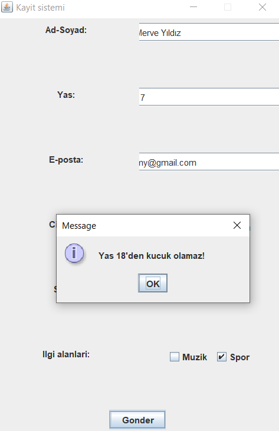

# 💻 Quenera v1.0
Quenera, BLM-121 Nesneye Yönelik Programlama dersi içeriğinde bulunan konuları tekrar etme ve proje alıştırması olması amacıyla yapılmaya başlanmıştır.  
Projenin sonradan gelişen amacı ise farklı derslerde anlatılan bilgileri harmanlayarak ortaya daha komplike ama daha kullanışlı bir proje çıkararak bu derslerdeki becerilerin geliştirilmesi ve gerçek hayatta kullanılan bilgi sistemlerine benzer bir app ortaya çıkarılmasıdır.

## Proje Konusu
Java'nın swing uygulaması ile kullanıcı bilgilerini toplama ve dosyaya kaydetmek temel amaçtır.

## 🧱Projede Faydalanılan Java Özellikleri
-Javax Swing ve JFrame  
-Multithreading  
-File Sınıfı ve Dosyalama  
-Interfaceler ve özellikleri  
-Exception Yapısı  
-Inheritance ve Encapsulation (OOP)  
-String ve StringBuilder  
-Abstract Sınıflar  
-Komut satırı argümanları (args)  
-Cloneable interface

## Ekran Görüntüsü
<h3>GUI ekranı</h3>
<table>
  <tr>
    <td></td>
  </tr>
</table>

<h3>Kayıt</h3>
<table>
  <tr>
    <td></td>
  </tr>
</table>

<h3>Exception</h3>
<table>
  <tr>
    <td></td>
  </tr>
</table>

<h3>Hatalı Kayıt</h3>
<table>
  <tr>
    <td></td>
  </tr>
</table>

## Kurulum
1. Projeyi klonlayın: git clone https://github.com/ysfcl/Quenera.git
2. Java 8 veya üzeri kurulu olduğundan emin olun.
3. IDE veya terminal üzerinden `Test.java` dosyasını çalıştırın.

## Gelecek Sürümler ve Eklenecekler
- **v1.1:** Dosya yolu ve GUI optimizasyonu
- **v2.0:** Veritabanı entegrasyonu ve işlenebilir kayıt yönetimi
- **v3.0:** İnternetten veri girişi entegrasyonu ve lokal girişler ile senkronizasyonu
- **v4.0:** Java altyapısı korunarak ASP.NET ile backend entegrasyonu ve projenin daha profesyonel bir yapıya bürünmesi

## Düzeltilmesi Gerekenler
1. Exception yapısı devreye girdiğinde kayıt işlemi yapılmamalı.
2. Tema ve kullanıcı tipi (öğrenci odaklı olması şart değil) daha net belirtilmeli.

